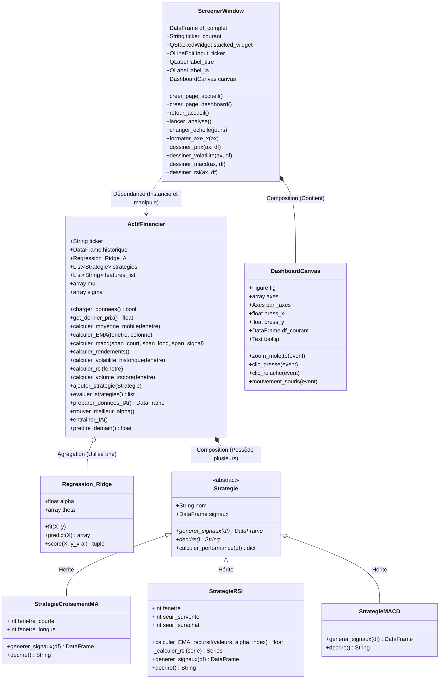

```mermaid
classDiagram
%% ==========================================
%% MODULE : algos_IA (Le Cerveau Mathématique)
%% ==========================================
class Regression_Ridge {
+float alpha
+array theta
+fit(X, y)
+predict(X) array
+score(X, y_vrai) tuple
}

    %% ==========================================
    %% MODULE : modeles (Le Moteur de Données)
    %% ==========================================
    class ActifFinancier {
        +String ticker
        +DataFrame historique
        +Regression_Ridge IA
        +List~Strategie~ strategies
        +List~String~ features_list
        +array mu
        +array sigma
        +charger_donnees() bool
        +get_dernier_prix() float
        +calculer_moyenne_mobile(fenetre)
        +calculer_EMA(fenetre, colonne)
        +calculer_macd(span_court, span_long, span_signal)
        +calculer_rendements()
        +calculer_volatilite_historique(fenetre)
        +calculer_rsi(fenetre)
        +calculer_volume_zscore(fenetre)
        +ajouter_strategie(Strategie)
        +evaluer_strategies() list
        +preparer_donnees_IA() DataFrame
        +trouver_meilleur_alpha()
        +entrainer_IA()
        +predire_demain() float
    }

    %% ==========================================
    %% MODULE : strategies (Les Règles Métier)
    %% ==========================================
    class Strategie {
        <<abstract>>
        +String nom
        +DataFrame signaux
        +generer_signaux(df)* DataFrame
        +decrire()* String
        +calculer_performance(df) dict
    }

    class StrategieCroisementMA {
        +int fenetre_courte
        +int fenetre_longue
        +generer_signaux(df) DataFrame
        +decrire() String
    }

    class StrategieRSI {
        +int fenetre
        +int seuil_survente
        +int seuil_surachat
        +calculer_EMA_recursif(valeurs, alpha, index) float
        -_calculer_rsi(serie) Series
        +generer_signaux(df) DataFrame
        +decrire() String
    }

    class StrategieMACD {
        +generer_signaux(df) DataFrame
        +decrire() String
    }

    %% ==========================================
    %% MODULE : screener_gui (L'Interface Graphique)
    %% ==========================================
    class DashboardCanvas {
        +Figure fig
        +array axes
        +Axes pan_axes
        +float press_x
        +float press_y
        +DataFrame df_courant
        +Text tooltip
        +zoom_molette(event)
        +clic_presse(event)
        +clic_relache(event)
        +mouvement_souris(event)
    }

    class ScreenerWindow {
        +DataFrame df_complet
        +String ticker_courant
        +QStackedWidget stacked_widget
        +QLineEdit input_ticker
        +QLabel label_titre
        +QLabel label_ia
        +DashboardCanvas canvas
        +creer_page_accueil()
        +creer_page_dashboard()
        +retour_accueil()
        +lancer_analyse()
        +changer_echelle(jours)
        +formater_axe_x(ax)
        +dessiner_prix(ax, df)
        +dessiner_volatilite(ax, df)
        +dessiner_macd(ax, df)
        +dessiner_rsi(ax, df)
    }

    %% ==========================================
    %% RELATIONS ET FLUX (Figures imposées)
    %% ==========================================

    %% Héritage (Figure Imposée validée)
    Strategie <|-- StrategieCroisementMA : Hérite
    Strategie <|-- StrategieRSI : Hérite
    Strategie <|-- StrategieMACD : Hérite

    %% Composition et Agrégation (Figure Imposée validée)
    ActifFinancier *-- Strategie : Composition (Possède plusieurs)
    ActifFinancier o-- Regression_Ridge : Agrégation (Utilise une)

    %% Relations de l'Interface
    ScreenerWindow *-- DashboardCanvas : Composition (Contient)
    ScreenerWindow ..> ActifFinancier : Dépendance (Instancie et manipule)
```
